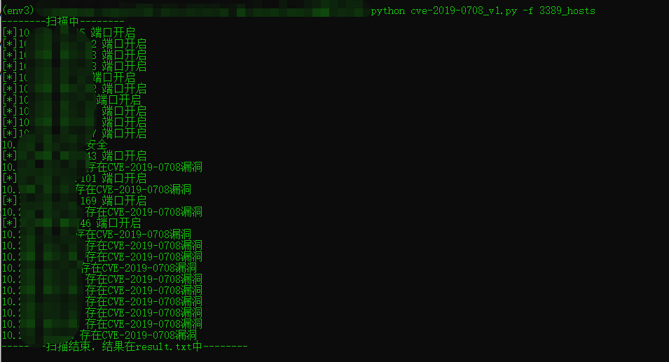

# CVE-2019-0708 批量检测

## 0x01 前言

CVE-2019-0708 Windows RDP 远程命令执行漏洞

Windows系列服务器于2019年5月15号，被爆出高危漏洞，该漏洞影响范围较广，windows2003、windows2008、windows2008 R2、windows xp * 系统都会遭到攻击，该服务器漏洞利用方式是通过远程桌面端口3389，RDP协议进行攻击的 。CVE-2019-0708漏洞是通过检查用户的身份认证，导致可以绕过认证，不用任何的交互，直接通过rdp协议进行连接发送恶意代码执行命令到服务器中去。这个漏洞是今年来说危害严重性最大的漏洞，换句话说，该漏洞是“可传播的”，这意味着任何利用该漏洞的恶意软件都可能从受影响的计算机传播到受影响的计算机，就像2017年WannaCry恶意软件在全球蔓延一样，跟之前的勒索，永恒之蓝病毒差不多。

## 0x02 批量检测

由于使用Windows系统的服务器有很多，需要批量排查，虽然在边界防火墙阻止tcp端口3389的连接，保护服务器免受来自外部的攻击，但针对内网横向攻击，还是要不打补丁等方式来保证服务器的安全

### 1> 360 RDP漏洞无损扫描器

0708detector.exe　程序是360公司的360Vulcan Team发布的一款针对编号为CVE-2019-0708的Windows远程桌面协议漏洞的检测程序,原则上该扫描程序不会造成目标系统出现蓝屏,请您测试后再使用。

程序校验码MD5，防止捆绑后门木马
febc027cee2782dba25b628ce3a893d6 *0708detector.exe

使用方法及结果判断请参考  readme(请读我).txt

#### 2> 基于360无损扫描器写的批量脚本

**环境**
```
python3.6
win10
```

**使用**
```
> python cve-2019-0708_v1.py -h
usage: cve-2019-0708_v1.py [-h] [-p PORT] [-t TARGET | -f FILE]

Example: python cve-2019-0708_v1.py -t 192.168.1.0/24 -p 3389

optional arguments:
  -h, --help            show this help message and exit
  -p PORT, --port PORT  默认端口3389
  -t TARGET, --target TARGET
                        可以输入单个IP地址，或者输入CIDR形式，如：192.168.1.0/24，注意CIDR格式，第一位必须是
                        所在IP段的网络号
  -f FILE, --file FILE  输入IP地址文件
```
大致就是先通过telnet判断是否打开3389端口，然后通过多线程调用360无损扫描器进行扫描



> 错误处理
```
错误’ValueError: IP(‘1.1.1.1/24’) has invalid prefix length (24)’的解决办法

这个是由于IP地址的CIDR格式引起的，根据IPy的库规定，第一位必须是所在IP段的网络号，正确的写法如下：

1.1.1.0/24 : 1.1.1.0~1.1.1.255

1.1.1.128/25 : 1.1.1.128~1.1.1.255

1.1.1.64/26 : 1.1.1.64~1.1.1.127

1.1.1.32/27 : 1.1.1.32~1.1.1.63

1.1.1.16/28 : 1.1.1.16~1.1.1.31
```

### 3> msf auxiliary/scanner/rdp/cve_2019_0708_bluekeep 模块


## 0x03 修复建议
1. 自行去微软官方下载对应的安全补丁进行补丁更新操作
2. 如果不需要，请禁用远程桌面服务
3. 在运行Windows 7，Windows Server 2008和Windows Server 2008 R2的提供支持版本的系统上启用网络级别身份验证（NLA），因为NLA要求的身份验证在漏洞触发点之前，所以受影响的系统可以利用NLA防御此漏洞的“蠕虫”恶意软件或高级恶意软件威胁。但是，如果攻击者具有可用于成功进行身份验证的有效凭据，则受影响的系统仍然容易受到远程执行代码执行（RCE）的攻击。
4. 在企业边界防火墙处阻止TCP端口3389
5. 避免将远程桌面服务（RDP，默认端口为3389）暴露在公网上（如为了远程运维方便确有必要开启，则可通过VPN登录后才能访问）